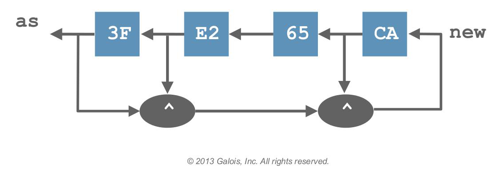

% Cryptol 🔑 - A DSL for cryptography
% Martin Heuschober;
  [CC-BY-NC-SA 4.0](http://creativecommons.org/licenses/by-nc-sa/4.0/)
% June 11th 2014

<link rel="stylesheet" href="highlight.js/styles/solarized_light.css">
<link rel="stylesheet" href="reveal.js/css/reveal.css"/>

Cryptol
=======

Disclaimer
----------

A lot of the examples and content was taken from the book one can get at [cryptol.net](http://www.cryptol.net/documentation.html).

Facts & Features
----------------

 - Written by Galois Inc.
 - Written in Haskell \o/
 - Uncommon syntax
 - Strongly typed
 - High Level
 - Abstract
 - Lazy
 - Polymorphic
 - Functional

--------------------------------------------------------------------------------

 - Included SAT-solver
 - Included SMT-solver
 - Interpreter
 - NOT good for production
 - BUT good for prototypes
 - good for learning
 - Open Source
 - ~150 pages book/documentation
. . .
 - Approved by the NSA

Syntax
======

Uncommon doesn't even grasp it
------------------------------

1. Everything has a type
2. Every number has a bit size

~~~haskell
 12 : [8]
~~~

This number `12` is represented as 8-bit number. 
You can find out about the type of something by

~~~haskell
> :t 12
12 : {a} (a >= 4, fin a) => [a]
~~~

There are Bits/Booleans
-----------------------

### `True` and `False`
With the operations

- `&&` = and
- `||` = or
- `^` = xor
- `~` = complement
- `if _ then _ else`

Numbers/Words/Characters
------------------------

Cryptol supports only **non-negative integers** with no upper bound

- default base 16 (reset with `:set base=n` for $n\in\{2,8,10,16\}$)
- write with prefixes `0b_`, `0o_`, `0x_`

~~~haskell
> 0b1010011
> 0o123
> 83
> 0x53
~~~

But usually one writes characters like `'a'`,`'b'` and `'z'`

Tupels
------

~~~haskell
> ('a',1+3)
> ('a',1,2,3,4)
~~~

And there are accessors, called projections, written `(1,'c').2`, which work
polymorphic for all tuples. But you can also use pattern matching like
`(one, _ ) = (1, "useless")`, where `_` is the discard variable.

Sequences
---------

Lists in Cryptol are the main workhorse syntax is as usual `[1]` or `[1..10]` or
`[1,3..100]` or `[100,97..1]`. Like any other modern language it has list
comprehensions

~~~haskell
[x*y| x <- [1..10], y <- [11,12]]
~~~

But we also have parallel comprehensions, which work like a zip.

~~~haskell
[(i,j)| i <- [1..10]
      | j <- [10,9..1]] = [(1,10),(2,9),(3,8),..,(10,1)]
~~~

On Types and Functions
======================

Lists have types too
--------------------

~~~haskell
[1..10] : [10][64]
~~~

I am not too happy with that syntax but it means `[1..10]` is a list of length
`10` with each element being a `64`-bit integer. But this allows for really cool
type level trickery and advanced awesomeness like doing algebra on type level.

Operations on lists
-------------------

We have operators

- `#`   = append
- `@`   = index
- `@@`  = slice
- `!`   = reverse index
- `!!`  = reverse slice
- `>>`  = shift right
- `>>>` = rotate right
- `<<`  = shift left
- `<<<` = rotate left

Other list functions
--------------------

~~~haskell
> join [[1 .. 4], [5 .. 8], [9 .. 12]]
> join [[1, 2, 3], [4, 5, 6], [7, 8, 9], [10, 11, 12]]
> transpose [[1, 2, 3, 4], [5, 6, 7, 8]]
> transpose [[1, 2, 3], [4, 5, 6], [7, 8, 9]]
~~~

Functions and polymorphism
--------------------------

One central piece of functional programming are of course functions, but one
cannot speak of those without mentioning polymorphism.

~~~haskell
> tail [1..10]
Assuming a = 4
[2,3,4,5,6,7,8,9,10]
~~~

But what type signature has `tail`?
-----------------------------------

~~~haskell
> :t tail
tail : {a, n} => [n+1]a -> [n]a
~~~
i.e. tail takes a list of `(n+1)`-elements of type `a` and spits out a list of
`n`-elements of the same type. Note that `n` does not necessarily need to be finite!

Functions continued
-------------------

But there are functions that have a bit more interesting types

~~~haskell
> :t split [1..12]
split [0..15] : {a,cols,rows} (a >= 4, fin a, fin rows,
    16 == cols * row) => [cols][rows][a]
~~~

Let us note that this type signature needs a teensy tiny bit explanation

--------------------------------------------------------------------------------

~~~haskell
a >= 4, a fin
~~~

Here `a` denotes the bit size; and the interpreter derived correctly that the
largest number in this list (`12`) needs at least 4 bits for representation.

~~~haskell
fin rows, 16 == cols * row
~~~

Another thing that the interpreter derived that the length of the list has to be
the product of the rows and columns you split the list into.

Backtick Syntax
---------------

But one grand thing is that cryptol provides syntax to pull type information
down to the function call level with *'backtick'* syntax:

~~~haskell
> split`{8} [0..15]
Assuming a = 4
[[0,1],[2,3]..[14,15]]
~~~

Other notable functions used with that syntax are `take`, `drop` and `groupBy`.

Numbers again
-------------

Numbers in cryptol are in reality just pretty printed bit-sequences, therefore
you can use all the list functions for numbers as well!

And then to characters and strings
----------------------------------

~~~haskell
> :set base=10
> :set ascii=off
> 'A'
65
> "ABC"
[65,66,67]
> 'C' - 'A'
2
~~~

Zero, Null, Nada
----------------

In cryptol `zero` is a polymorphic 'value' and represents the number zero in any
setting you like. This is especially useful with the complement operator `~`.

More syntactic sugar
====================

Streams
-------

Often in crypto one encounters stream ciphers which are depicted

<!---->

--------------------------------------------------------------------------------

And can be written in cryptol as follows

~~~haskell
as = [0x3F, 0xE2, 0x65, 0xCA] # new
   where new = [a ^ b ^ c | a <-          as
                          | b <- drop`{1} as
                          | c <- drop`{3} as]
~~~

Polynomials
-----------

For the AES algorithm one of the basic building blocks Galois fields, which are
just polynomials with coefficients in $\mathbb F_2$, i.e. $\{0,1\}$. So we can
write the term $x^7+x^4+x+1$

~~~haskell
> <|x^^7+x^^4+x+1|>
Assuming a = 8
147
> <|x^^2 +x +1|>
Assuming a = 3
7
~~~~

--------------------------------------------------------------------------------

As these polynomials are equivalent to numbers written in binary we get the
result of `147`. Cryptol also provides polynomial multiplication, which I do not
yet understand fully understand (maybe I'll provide some explanation when I do).

~~~haskell
> <|x^^7+x^^4+x+1|> ^ <| x^^2 +x +1|>
Assuming a = 8
148
~~~

Tests, Satisfiability and Provability
=====================================

Why is this useful
------------------

A lot of cryptographic algorithms have universal properties

- most important equation: `decode . encode == id`
- hash collisions: `hash x /= hash y || x == y`
- for the Caesar cipher and related: `length . encode = length`
- for many hash functions `length . hash = constant`

Tests
-----

As cryptol has its origin in the language of haskell it comes bundled with the
powerful tool 'QuickCheck'. You can invoke this by

~~~haskell
> :check \xx -> reverse (reverse xx) == (xx :[10][8])
Using random testing.
Passed 100 tests.
Coverage: 0.00% (100 of 2^^80 values)
~~~

Proofs
------

While tests are a good indicator, where your code has gone wrong, proofs are the
more recommended thing. They are more solid and with cryptography you don't want
to skimp on the solidity of your programs/algorithms!

You can invoke proofs with

~~~haskell
> :prove \x y -> (x^^2-y^^2)== ((x:[8])-y)*((y:[8])+x)
~~~

--------------------------------------------------------------------------------

Cryptol itself does not provide a satisfiability solver but it uses the open
source tool

- [CVC4](http://cvc4.cs.nyu.edu/)

Or alternatively

- Microsoft's [Z3](http://z3.codeplex.com/)
- [Yices](http://yices.csl.sri.com/download-yices2.shtml).

Satisfiability
--------------

SAT solver is a topic I've never touched before, but it is a quite powerful tool
to have. Let us see this in an example:

~~~haskell
file: isSqrt x y = x == y*y
> :sat \x -> isSqrt x (9:[8]) && ~(elem (x,[3]))
\x -> isSqrt x (9:[8]) && ~(elem (x,[3])) 125 True
> :sat \x -> isSqrt x (9:[8]) && ~(elem (x,[3,125]))
\x -> isSqrt x (9:[8]) && ~(elem (x,[3,125])) 131 True
> :sat \x -> isSqrt x (9:[8]) && ~(elem (x,[3,125,131]))
\x -> isSqrt x (9:[8]) && ~(elem (x,[3,125,131])) 253 True
> :sat \x -> isSqrt x (9:[8]) && ~(elem (x,[3,125,131,253]))
Unsatisfiable.
~~~

--------------------------------------------------------------------------------

We see that there are a lot more solutions than the expected `3` and
`-3 % 256 == 256`. Of course in other situations the SAT solver might not find
solution in a given setting (here 8-bit integers) maybe just because the
computing resources are not sufficient or maybe the general answer might
not be true - so be careful and think about the answers given.

E-mail
======

---

[...]

> # Infix operators
>
> Am I right that the backtick syntax prevents you from using the infix
> syntax for normal functions, as used in haskell?

I'm not positive, but our goal is for Cryptol to be familiar to crypto
mathematicians, and this syntax, while good for Haskell programmers,
wouldn't come as naturally to math folks.

--------------------------------------------------------------------------------

> # Pros and Co.
>
> What do you consider the nicest features of cryptol?
>
> Mine is the type level algebra you can do with list length especially in
> combination with the backtick syntax!

Absolutely!  Another is the very powerful connection to SMT solvers, making
:prove and :sat possible. Another is whenever I see a Cryptol program that
either looks like, or improves upon, the original paper's specification, it makes
me smile.

--------------------------------------------------------------------------------

> # Cons and Co.
>
> What does the language lack?

I'd like user-defined infix operators. Being able to model crypto protocols
would be a very powerful thing (will require sequential features).

> What are the shortcomings?

It's difficult to write the type constraints for padding operations. We're
thinking about connecting to more powerful solvers for these.

> What do you want to improve?

All of the above!

--------------------------------------------------------------------------------

> # Implementation
> Where were the obstacles you met when implementing the language?
> Which did you expect and what was harder than you assumed before?

I don't think we had any surprises, since v2 of Cryptol both built on our
experience with v1, and on a lot of powerful Haskell libraries (like SBV).
Even so, solving the non-linear type constraints is a constant source
of frustration and surprise.

> What are the future plans for cryptol?

Modeling protocols, integration with our SAW tools to verify and generate
implementations in (e.g., C, Java, FPGA, ...)

--------------------------------------------------------------------------------

> # Galois.Inc
>
> Is there something you would like to mention at my user group?
> Are you hiring?

Yes, we are!

> Is it possible to work from europe vai

Unfortunately, not at present.

--------------------------------------------------------------------------------

> # Your Collaborators?
>
> Why did you work with the NSA? - After the revelations of Edward Snowden
> it does not make a good impression and provides a good reason not to use
> Cryptol.

The NSA has two missions. Snowden's revelations are about the "offensive" side
(pun not intended, but often apt). The other mission is defensive. There is
talk about separating those missions into separate organizations, which has
its pros and cons. We'll see.

--------------------------------------------------------------------------------

> Are there many backdoors in the language/compiler ?

Allowing you to answer that question for yourself is a large reason for our
open-sourcing it.  You can use the source on GitHub to build the same binaries
as we release.

> Can you tell me how the NSA is using this language?

You'd have to ask them -- but the obvious answer is "to specify cryptographic
algorithms in an unambiguous and readable way."

[...]

Resources
=========

Links
-----

- [cryptol](http://crytol.net)
- [mail](mailto:cryptol@galois.com)
- [slides](http://github.com/epsilonhalbe/Talks/Cryptalk)

Book
----

- [Documentation](http://cryptol.net/documentation.html)
